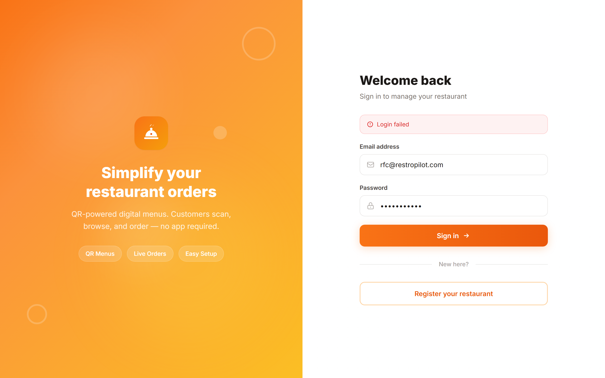
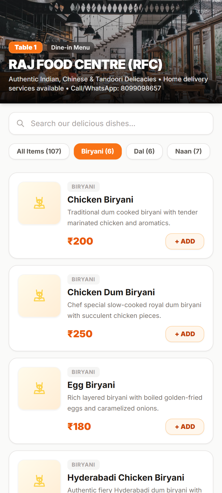
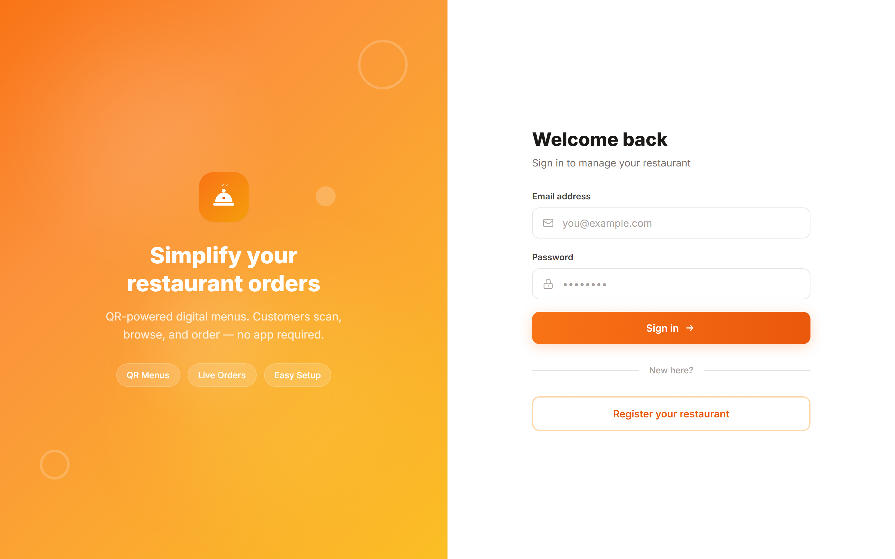
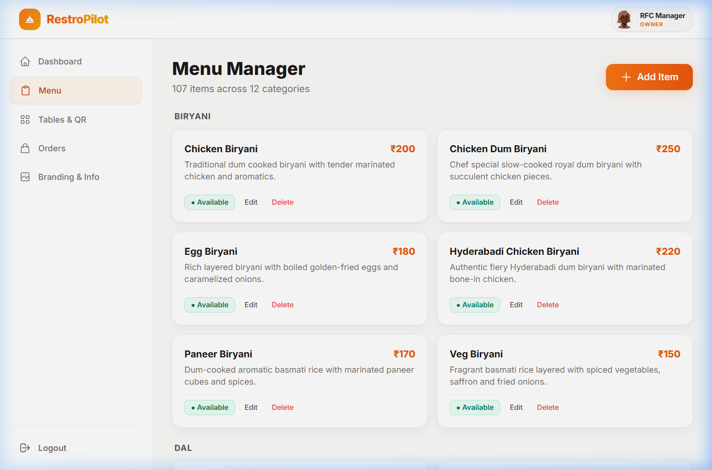
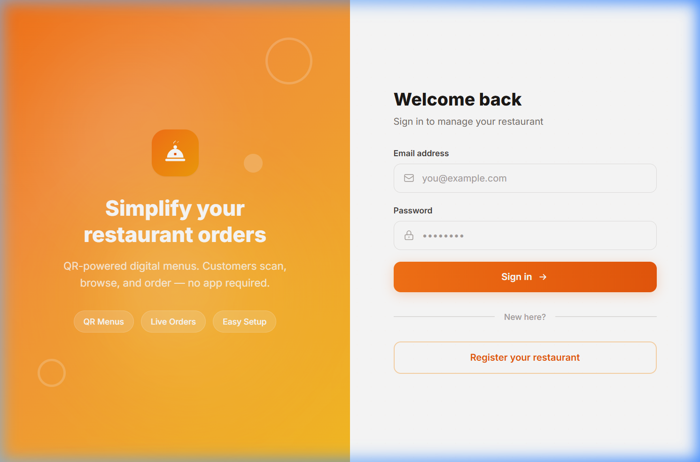

# RestroPilot

> Contactless QR restaurant ordering and table management platform.
> Designed for dine-in operations with direct camera scan ordering, live kitchen order management, and simplified table tracking.

---

## Application Preview

| Owner Dashboard | Customer Mobile Menu |
| :---: | :---: |
|  |  |
| **Table & QR Manager** | **Menu Management** |
|  |  |
| **Authentication Portal** | |
|  | |

---

## Key Features

- **Contactless Mobile QR Ordering**: Diners scan table QR codes using their mobile camera to browse the menu and submit orders directly to the kitchen without downloading an application.
- **Order Status Tracking**: One-click status progression (`Pending` -> `Served` -> `Paid`) for clear dining room and kitchen synchronization.
- **Collection Register**: Real-time aggregation of settled table orders into a live paid collection summary.
- **Table Clearing**: One-click table clearance upon payment settlement to free dining tables and keep database storage efficient.
- **Table & QR Management**: Create numbered dining tables and download high-contrast QR codes ready for table placement.
- **Profile Customization**: Interactive avatar customization for restaurant managers and branding profile controls.
- **Multi-Tenant Isolation**: Strict data isolation per restaurant ID across menus, tables, orders, and configurations.

---

## Technology Stack

| Layer | Technology |
|---|---|
| Frontend Framework | React 19, Vite |
| Styling & UI | Vanilla CSS / Tailwind CSS |
| Client Routing | React Router v7 |
| QR Engine | qrcode (Canvas and SVG) |
| Backend Runtime | Node.js, Express 4 |
| Database | MongoDB Atlas, Mongoose 8 |
| Authentication | JSON Web Tokens (JWT), bcryptjs |
| Deployment Targets | Render (Backend API), Vercel (Frontend Client) |

---

## Project Structure

```text
Food SaaS/
├── client/                     # Frontend Application (React + Vite)
│   ├── public/                 # Static assets and favicon
│   ├── src/
│   │   ├── api/                # Axios configuration and API interceptors
│   │   ├── components/         # Layout components (Navbar, Sidebar, Logo)
│   │   ├── context/            # AuthContext state management
│   │   ├── pages/
│   │   │   ├── auth/           # Login and Restaurant Registration
│   │   │   ├── customer/       # Mobile Menu, Cart, Order Confirmation
│   │   │   ├── owner/          # Dashboard, Orders, MenuManager, TableManager, Profile
│   │   │   └── superAdmin/     # Platform Management and Approvals
│   │   ├── App.jsx             # Route definitions and layouts
│   │   └── index.css           # Global typography and base styles
│   ├── vercel.json             # Vercel SPA routing configuration
│   └── package.json
│
├── server/                     # Backend API (Node.js + Express)
│   ├── config/
│   │   └── db.js               # MongoDB Atlas connection with SRV DNS resolver
│   ├── controllers/            # Orders, Menu, Tables, Restaurant, Admin
│   ├── middleware/             # Auth and role verification middleware
│   ├── models/                 # User, Restaurant, MenuItem, Table, Order
│   ├── routes/                 # Express API route endpoints
│   ├── seedAll.js              # Database seed script for initial testing
│   ├── server.js               # Application entry point and CORS setup
│   └── package.json
│
├── docs/
│   └── screenshots/            # Application interface preview images
├── DEPLOYMENT.md               # Step-by-step production deployment instructions
└── README.md                   # Project documentation
```

---

## Quick Start & Local Setup

### 1. Prerequisites
- Node.js (v18 or higher)
- MongoDB Atlas cluster or local MongoDB instance

### 2. Clone the Repository
```bash
git clone https://github.com/AvirajGitHub7/RestroPilot.git
cd RestroPilot
```

### 3. Server Setup
```bash
cd server
npm install
```

Create a `.env` file in the `server` directory (reference `.env.example`):
```env
PORT=5000
MONGO_URI=mongodb+srv://<username>:<password>@<cluster>.mongodb.net/<database>?retryWrites=true&w=majority
JWT_SECRET=your_jwt_secret_key
CLIENT_URL=http://localhost:5173
```

Seed initial restaurant data and menu items:
```bash
npm run seed
```

Start the backend server:
```bash
npm run dev
```

### 4. Client Setup
In a new terminal window:
```bash
cd client
npm install
npm run dev
```

Open [http://localhost:5173](http://localhost:5173) in your browser.

---

## Account Access & Onboarding

- **New Restaurant Registration**: Navigate to `/register` in your browser to create a new restaurant profile and automatically provision tables and QR codes.
- **Admin Access**: Super Administrator accounts manage approvals across the platform.
- **Sample Data**: Running `npm run seed` populates sample restaurants and full menus for local testing.

---

## Production Deployment

Deploy the backend to Render first, followed by the frontend on Vercel. Full step-by-step guides are documented in [DEPLOYMENT.md](DEPLOYMENT.md).

### Summary:
1. **Backend (Render)**:
   - Root directory: `server`
   - Build command: `npm install`
   - Start command: `npm start`
   - Environment variables: `PORT`, `MONGO_URI`, `JWT_SECRET`, `CLIENT_URL`

2. **Frontend (Vercel)**:
   - Root directory: `client`
   - Framework preset: `Vite`
   - Build command: `npm run build`
   - Environment variable: `VITE_API_BASE_URL=https://<your-render-service>.onrender.com/api`

---

## License

This project is licensed under the MIT License.
